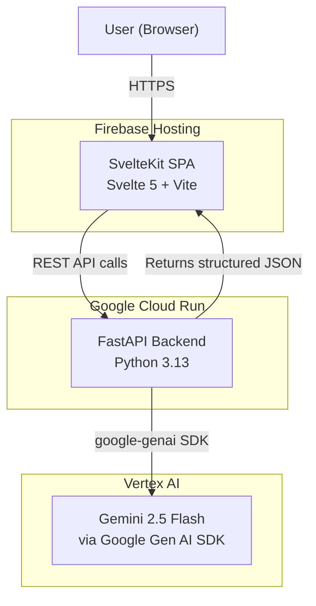
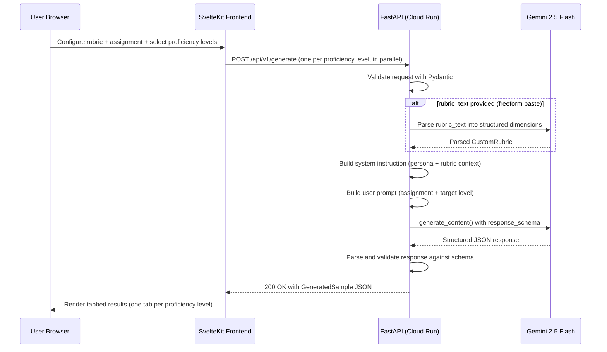

# Architecture -- Synthetic Student Generator

## High-Level Service Architecture



## Tech Stack

| Service | Technology | Version | Rationale |
|---------|-----------|---------|-----------|
| **Backend API** | FastAPI | 0.115+ | Async-first Python framework with built-in OpenAPI docs, Pydantic integration for request/response validation, and minimal boilerplate |
| **Runtime** | Python | 3.13 | Current stable release with full ecosystem support; required by modern FastAPI and google-genai |
| **LLM Access** | Google Gen AI SDK (`google-genai`) | 1.x (latest) | Replaces the deprecated `vertexai.generative_models` module; unified SDK for both Gemini API and Vertex AI; supports structured output natively |
| **LLM Model** | Gemini 2.5 Flash | `gemini-2.5-flash` | GA on Vertex AI; fast inference, low cost, 1M token context window; supports JSON response schema enforcement |
| **Frontend** | SvelteKit | 2.x (Svelte 5) | Lightweight SPA with file-based routing, static adapter for Firebase Hosting; adds framework variety to portfolio (alongside React and Astro projects) |
| **Frontend Tooling** | Vite | 6.x | Fast dev server with HMR; optimized production builds; first-class Svelte support |
| **Frontend Hosting** | Firebase Hosting | N/A | CDN-backed static hosting with custom domain support; already configured in user's GCP project |
| **Container Runtime** | Cloud Run | N/A | Serverless containers with automatic scaling to zero; no infrastructure management; native IAM for Vertex AI access |
| **Containerization** | Docker | N/A | Standard OCI container for reproducible builds and Cloud Run deployment |
| **Data Validation** | Pydantic | 2.x | Schema enforcement for API request/response models; used by FastAPI natively |

## Data Flow

### Generate Calibration Set -- Request Flow

The primary workflow generates a **calibration set** — one sample per selected proficiency level. The frontend sends parallel individual `POST /api/v1/generate` requests (one per level) and assembles the results client-side.



### Key Data Flow Details

1. **Request arrives** at FastAPI with a rubric source (`template_id`, `rubric`, or `rubric_text`), assignment prompt, target proficiency level, and optional persona config.
2. **Rubric is resolved:** If `template_id` is provided, the template is loaded from bundled JSON. If `rubric_text` is provided (freeform paste), Gemini is called with a rubric-parsing prompt to extract structured dimensions. If `rubric` is provided, it's used directly.
3. **System instruction is assembled** dynamically: a base persona template is populated with the proficiency level and rubric dimensions. This instruction tells the model to role-play as a specific type of student.
4. **User prompt contains** the assignment prompt the "student" should respond to.
5. **Gemini is called** with `response_mime_type: "application/json"` and a `response_schema` defining the expected output structure. This enforces structured output at the model level.
6. **Response is validated** server-side against the Pydantic model before returning to the frontend.
7. **Frontend assembles results:** For calibration sets, the frontend sends parallel requests and displays results in a tabbed view (one tab per proficiency level).

## Key Design Decisions

### 1. Structured Output Approach

**Decision:** Use Gemini's native `response_schema` parameter rather than post-hoc JSON parsing.

**Rationale:** Gemini 2.5 Flash supports constrained decoding with a JSON schema. By passing a `response_schema` to the API call, the model is forced to produce valid JSON matching the schema. This eliminates regex-based extraction or retry loops for malformed JSON. The schema is defined once as a Pydantic model and converted to the format expected by the Gen AI SDK.

**Implementation:**
- Define a Pydantic model (`GeneratedSampleOutput`) with fields: `student_response`, `proficiency_scores`, `persona_notes`, `writing_traits`.
- Convert this to a JSON schema dict and pass it as `response_schema` in the `generate_content` call.
- Parse the response directly with `json.loads()` -- no fallback parsing needed.

### 2. Persona System Design

**Decision:** Use a parameterized persona template system rather than fixed persona profiles.

**Rationale:** Fixed personas limit the diversity of generated samples. Instead, the system defines persona dimensions (grade level, writing strengths, writing weaknesses, common error types, vocabulary level, voice characteristics) that are composed into a system instruction at request time. This allows the frontend to request a "developing" student who is strong in ideas but weak in conventions, producing a unique persona per request.

**Persona dimensions:**
- `grade_level`: Integer (5-12) controlling age-appropriate vocabulary and syntax
- `proficiency_target`: Enum (Below, Approaching, Proficient, Exemplary) for overall level
- `rubric_dimension_scores`: Dict mapping rubric dimensions to individual scores
- `error_patterns`: List of error types to inject (run-on sentences, comma splices, weak transitions, etc.)
- `voice_traits`: List of stylistic traits (formal, conversational, tentative, confident)

### 3. Frontend Framework Choice

**Decision:** SvelteKit 2 (Svelte 5) with static adapter for Firebase Hosting.

**Rationale:** SvelteKit provides a 4-screen flow (Landing → Configure → Loading → Results) managed with Svelte stores for client-side state. Svelte 5's runes syntax (`$state`, `$derived`, `$effect`) provides reactive UI with minimal boilerplate. The static adapter outputs a pre-rendered SPA to `dist/` for Firebase Hosting. Using SvelteKit adds framework variety to the portfolio (alongside React and Astro in other projects). The primary workflow is generating a calibration set (multiple proficiency levels in parallel), with a tabbed results view.

### 4. No Database

**Decision:** No persistent storage. Rubric templates are hardcoded; generated samples are ephemeral.

**Rationale:** This is a demo/portfolio project. Adding Firestore would increase complexity without demonstrating new engineering patterns. Rubric templates are stored as JSON files bundled with the backend. Generated samples are returned to the client and not persisted. If persistence is needed later, a Firestore collection can be added without architectural changes.

### 5. Google Gen AI SDK over Vertex AI SDK

**Decision:** Use `google-genai` package instead of `google-cloud-aiplatform` / `vertexai`.

**Rationale:** Google deprecated the `vertexai.generative_models` module in June 2025, with removal scheduled for June 2026. The `google-genai` SDK is the officially recommended replacement. It provides a unified interface for both the Gemini Developer API and Vertex AI API, with native support for structured output, streaming, and function calling.

## Folder and File Structure

### Backend (`/backend`)

```
backend/
  Dockerfile
  requirements.txt
  .env.example
  app/
    __init__.py
    main.py                  # FastAPI app factory, CORS config, router mounting
    config.py                # Settings via pydantic-settings (project ID, region, model name)
    routers/
      __init__.py
      generate.py            # POST /api/v1/generate endpoint
      templates.py           # GET /api/v1/templates endpoint
      health.py              # GET /api/v1/health endpoint
    models/
      __init__.py
      requests.py            # Pydantic models for API request bodies
      responses.py           # Pydantic models for API response bodies
      schemas.py             # Gemini response_schema definitions (for structured output)
    services/
      __init__.py
      generator.py           # Orchestrates prompt building + Gemini call + response parsing
      prompt_builder.py      # Assembles system instructions and user prompts from parameters
      gemini_client.py       # Wraps google-genai SDK initialization and generate_content calls
      rubric_parser.py       # Parses freeform rubric_text into structured CustomRubric via Gemini
    data/
      rubric_templates.json  # Bundled rubric templates (e.g., 6-Trait Writing, AP Essay)
    prompts/
      persona_template.txt   # System instruction template with placeholder variables
```

### Frontend (`/frontend`)

```
frontend/
  svelte.config.js             # Static adapter config (outputs to dist/)
  vite.config.ts               # Vite + Tailwind + API proxy for dev
  firebase.json                # Firebase Hosting + Cloud Function API proxy
  .firebaserc                  # Firebase project/target config
  functions/
    src/index.ts               # Express API proxy Cloud Function
  src/
    app.html                   # HTML shell with Material Symbols font
    app.css                    # Tailwind CSS + proficiency-level color tokens
    routes/
      +layout.svelte           # Root layout: header, content slot, Footer
      +layout.ts               # Disable SSR, enable prerender (static adapter)
      +page.svelte             # Screen router based on currentScreen store
    lib/
      api.ts                   # Fetch wrapper for backend API calls
      types.ts                 # TypeScript types and proficiency-level constants
      stores.ts                # Svelte stores for app state (screen, form, results)
      components/
        LandingPage.svelte     # Screen 1: Hero, 3-step visual, hardcoded example, CTA
        ConfigurePage.svelte   # Screen 2: Single-page form (rubric + assignment + levels)
        LoadingPage.svelte     # Screen 3: Per-level progress cards (spinner → checkmark)
        ResultsPage.svelte     # Screen 4: Tabbed results with copy/export actions
        Footer.svelte          # Random education quote + API status indicator
```
